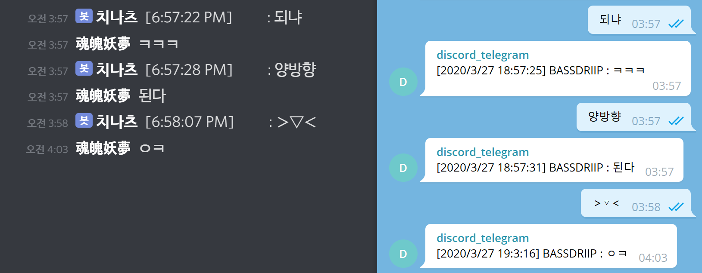

# Discord-Telegram-Duplex-Bot

Duplex system for simple text message between Telegram and Discord



＞ ▽ ＜

## How to use

1.  Install dependencies

    ```
    $ npm i
    ```

2.  Create `docker-compose.yml`.

    ```
    # See docker-compose-example.yml
    ```

3.  Run!

    ```
    $ docker-compose up -d
    ```

## TODO

- [x] Write TODO
- [x] Fix timezone issue
- [x] Handle reply in Telegram
- [ ] Fix API structure
- [ ] Support stickers
- [ ] Support photos
- [ ] More stable deployments
